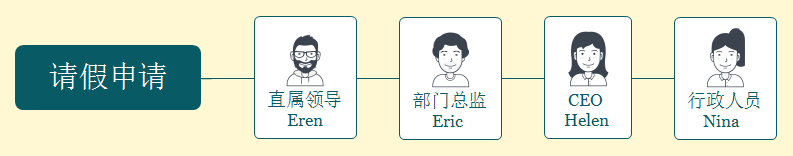
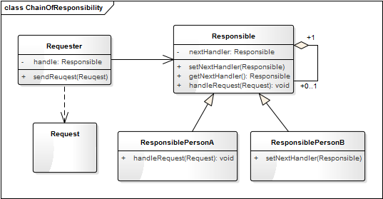

# 05 职责模式：我的假条去哪了

【故事剧情】

周五了，Tony 因为家里有一些重要的事需要回家一趟，于是向他的领导 Eren 请假，填写完假条便交给了 Eren。得到的回答却是：“这个假条我签不了，你得等部门总监同意！” Tony 一脸疑惑：“上次去参加 SDCC 开发者大会请了一天假不就是您签的吗？” Eren：“上次你只请了一天，我可以直接签。现在你是请五天，我要提交给部门总监，等他同意才可以。”

Tony：“您怎么不早说啊？” Eren：“你也没问啊！下次请假要提前一点……”

Tony 哪管这些啊！对他来说，每次请假只要把假条交给 Eren，其他的事情都交给领导去处理吧！

事实却是，整个请假的过程要走一套复杂的流程：

- 小于等于2天，直属领导签字，提交行政部门；

- 大于2天，小于等于5天，直属领导签字，部门总监签字，提交行政部门；

- 大于5天，小于等于1月，直属领导签字，部门总监签字，CEO 签字，提交行政部门。


### 用程序来模拟生活

对于 Tony 来说，他只需要每次把假条交给直属领导，其他的繁琐流程他都可以不用管，所以他并不知道请假流程的具体细节。但请假会影响项目的进展和产品的交互，所以请假其实是一种责任担当的过程：你请假了，必然会给团队或部门增加工作压力，所以领导肯定会控制风险。请假的时间越长，风险越大，领导的压力和责任也越大，责任人也就越多，责任人的链条也就越长。

程序来源于生活，我们可以用程序来模拟这一个有趣的场景。

源码示例：

```python
class Person:

    "请假申请人"

    def __init__(self, name, dayoff, reason):

        self.__name = name

        self.__dayoff = dayoff

        self.__reason = reason

        self.__leader = None
    def getName(self):

        return self.__name
    def getDayOff(self):

        return self.__dayoff
    def getReason(self):

        return self.__reason
    def setLeader(self, leader):

        self.__leader = leader
    def reuqest(self):

        print(self.__name, "申请请假", self.__dayoff, "天。请假事由：", self.__reason)

        if( self.__leader is not None):

            self.__leader.handleRequest(self)
class Manager:

    "公司管理人员"
    def __init__(self, name, title):

        self.__name = name

        self.__title = title

        self.__nextHandler = None
    def getName(self):

        return self.__name
    def getTitle(self):

        return self.__title
    def setNextHandler(self, nextHandler):

        self.__nextHandler = nextHandler
    def getNextHandler(self):

        return self.__nextHandler
    def handleRequest(self, person):

        pass
class Supervisor(Manager):

    "主管"
    def __init__(self, name, title):

        super().__init__(name, title)
    def handleRequest(self, person):

        if(person.getDayOff() 2 and person.getDayOff()  5 and person.getDayOff() Sunny 申请请假 1 天。请假事由： 参加MDCC大会。

同意 Sunny 请假，签字人： Eren ( 客户端研发部经理 )

Sunny 的请假申请已审核，情况属实！已备案处理。处理人： Nina ( 行政中心总监 )
Tony 申请请假 5 天。请假事由： 家里有紧急事情！

同意 Tony 请假，签字人： Eric ( 技术研发中心总监 )

Tony 的请假申请已审核，情况属实！已备案处理。处理人： Nina ( 行政中心总监 )
Pony 申请请假 15 天。请假事由： 出国深造。

同意 Pony 请假，签字人： Helen ( 创新文化公司CEO )

Pony 的请假申请已审核，情况属实！已备案处理。处理人： Nina ( 行政中心总监 )

### 从剧情中思考职责模式

从请假这个示例中我们发现，对于 Tony 来说，他并不需要知道假条处理的具体细节，甚至不需要知道假条去哪儿了，他只需要知道假条有人会处理。而假条的处理流程是一手接一手的责任传递，处理假条的所有人构成了一条**责任的链条**。链条上的每一个人只处理自己职责范围内的请求，对于自己处理不了请求，直接交给下一个责任人。这就是程序设计中职责模式的核心思想。



**职责模式**： 避免请求发送者与接收者耦合在一起，让多个对象都有可能接收请求，将这些对象连接成一条链，并且沿着这条链传递请求，直到有对象处理它为止。职责模式也称为责任链模式，它是一种对象行为型模式。

职责链模式将请求的发送者和接受者解耦了。客户端不需要知道请求处理者的明确信息和处理的具体逻辑，甚至不需要知道链的结构，它只需要将请求进行发送即可。

在职责链模式中我们可以随时随地的增加或者更改一个责任人，甚至可以更改责任人的顺序，增加了系统的灵活性。但是有时候可能会导致一个请求无论如何也得不到处理，它会被放置在链末端。

### 职责模式的模型抽象

#### 代码框架

上面的示例代码还是相对比较粗糙，我们可以对它进行进一步的重构和优化，抽象出职责模式的框架模型。

```python
class Request:

    "请求(内容)"
    def __init__(self, name, dayoff, reason):

        self.__name = name

        self.__dayoff = dayoff

        self.__reason = reason

        self.__leader = None
    def getName(self):

        return self.__name
    def getDayOff(self):

        return self.__dayoff
    def getReason(self):

        return self.__reason
class Responsible:

    "责任人的抽象类"
    def __init__(self, name, title):

        self.__name = name

        self.__title = title

        self.__nextHandler = None
    def getName(self):

        return self.__name
    def getTitle(self):

        return self.__title
    def setNextHandler(self, nextHandler):

        self.__nextHandler = nextHandler
    def getNextHandler(self):

        return self.__nextHandler
    def handleRequest(self, request):

        pass

```

#### 类图

上面的代码框架可用类图表示如下：



#### 基于框架的实现

有了上面的代码框架之后，我们要实现示例代码的功能就会更简单了，代码也会更加优雅。最开始的示例代码我们假设它为 version 1.0，那么再看看基于框架的 version 2.0 吧。

```python
class Person:

    "请求者"
    def __init__(self, name):

        self.__name = name

        self.__leader = None
    def setName(self, name):

        self.__name = name
    def getName(self):

        return self.__name
    def setLeader(self, leader):

        self.__leader = leader
    def getLeader(self):

        return self.__leader
    def sendReuqest(self, request):

        print(self.__name, "申请请假", request.getDayOff(), "天。请假事由：", request.getReason())

        if (self.__leader is not None):

            self.__leader.handleRequest(request)
class Supervisor(Responsible):

    "主管"
    def __init__(self, name, title):

        super().__init__(name, title)
    def handleRequest(self, request):

        if (request.getDayOff()  2 and request.getDayOff()  5 and request.getDayOff()
